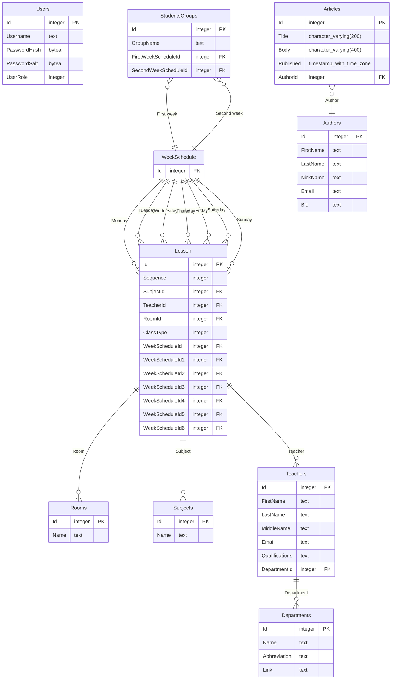

# Інтерактивний розклад UAD (АПІ для розкладів)

**Інтерактивний розклад UAD** - це веб-сервіс, створений для спрощення управління розкладами студентів. Спочатку розроблявся як бекенд для [Interactive Schedule UAD](https://github.com/Seagullie/InteractiveScheduleUAD) React Native додатку, але в майбутньому може стати самостійним продуктом.

## Можливості

- 💾 Підтримка баз даних
  - ✔️ PostgreSQL
  - ❌ MongoDB
  - ❌ Redis (кеш?)
- 🐳 Підтримка Docker
  - ✔️ Локальна розробка з локальною базою даних (compose, автоматично)
  - ✔️ GitHub Codespaces з власною базою даних (створюється автоматично)
  - ✔️ Хмарне розгортання з хмарною базою даних (Dockerfile, вручну)
- 🔐 JWT
  - ✔️ Аутентифікація за допомогою ролей
  - ✔️ Оновлення токенів
  - ✔️ Вихід з системи
- 💼 Бізнес-логіка
  - ✔️ Маппінг (Mapperly)
  - ✔️ Монада результатів (поки що `FluentResults`, але буде змінено на `OneOf`)
  - 🔜 Валідація (FluentValidation)
  - ❌ Запуск без підключення до бази даних

## Початок роботи

### Використання GitHub Codespaces (найпростіший спосіб протестувати):

1. Запустіть свій Codespace з цього репозиторію (додаткового налаштування не потрібно).

### Запуск локально в Visual Studio:

1. Створіть власний файл `.env` (приклад наведено у файлі `.env.example`).
2. Запустіть проект Docker Compose.

### Запуск на хмарі або віртуальній машині (VM):

Якщо у вас є доступ до консолі ВМ:

1. Створіть власний файл `.env` (приклад наведено у файлі `.env.example`).
2. Виконайте команду `docker compose` в консолі (переконайтеся, що ви встановили Docker, перш ніж продовжувати).

Якщо у вас є можливість використовувати тільки Docker-файли:

1. Знайдіть провайдера бази даних.
2. Вручну введіть всі змінні оточення (з файлу `.env`).
3. Вкажіть шлях до Docker-файлу.

## ER-діаграма

> Ця структура даних виглядає не найкраще, оскільки автоматично генерується з коду. Планується пізніше переписати структуру вручну, використовуючи SQL.

