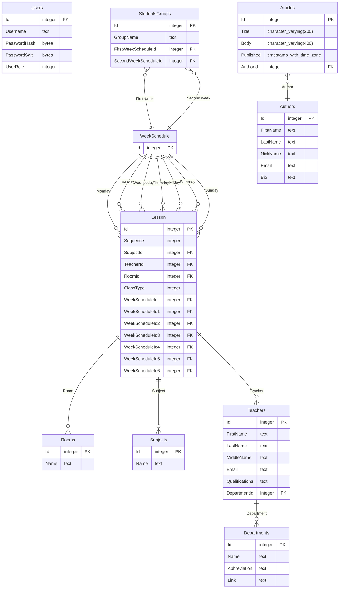

# Interactive Schedule UAD

**Interactive Schedule UAD** is a web service that simplifies the management of student schedules. Originally developed as the backend for the [Interactive Schedule UAD](https://github.com/Seagullie/InteractiveScheduleUAD) React Native app, but it may become a standalone product in the future.

## Features

- 💾 Database Support
  - ✔️ PostgreSQL
  - ❌ MongoDB
  - ❌ Redis (cache?)
- 🐳 Docker Support
  - ✔️ Local development with a local database (compose, automatic)
  - ✔️ GitHub Codespaces with its own database (compose, automatic)
  - ✔️ Cloud deployment with a cloud database (Dockerfile, manual)
- 🔐 JWT
  - ✔️ Authentication with roles
  - ✔️ Refresh tokens
  - ✔️ Logout
- 💼 Business logic
  - ✔️ Mapping (Mapperly)
  - ✔️ Result Monad (FluentResults for now, but I will change it to OneOf)
  - 🔜 Validation (FluentValidation)
  - ❌ Run without a database connection

## Getting Started

### Using GitHub Codespaces (easiest way to test it out):
1. Run own Codespace from this repository (no additional configuration required).

### Running Locally in Visual Studio:
1. Create your own `.env` file (an example is provided in `.env.example`).
2. Run the Docker Compose project.

### Running on a Cloud or Virtual Machine (VM):

If you have access to the VM console:
1. Create your own `.env` file (an example is provided in `.env.example`).
2. Run the `docker compose` command in the console (make sure to install Docker before proceeding).

If you only have the ability to use Dockerfiles:
1. Find a database provider.
2. Manually enter all the environment variables (from the `.env` file).
3. Specify the path to the Dockerfile.

## ER Diagram

> This data structure is so terrible because it is auto-generated from code. Later, I will definitely rewrite it by hand using SQL or create normal model classes 🥲

